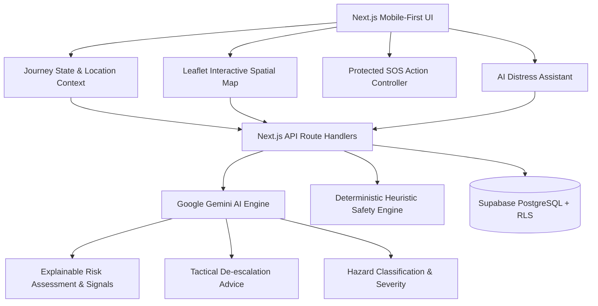

# GuardianAI — Predictive AI Safety Intelligence

> **"Instead of waiting for danger to happen, GuardianAI uses contextual AI to help identify and respond to potential safety risks earlier."**

[](https://nextjs.org/)
[](https://www.typescriptlang.org/)
[](https://tailwindcss.com/)
[](https://ai.google.dev/)
[](https://leafletjs.com/)
[](https://supabase.com/)

---

## 🛡️ Problem: The Reactive Safety Paradox
Most modern personal safety applications are purely **reactive** — they remain dormant until the user is already in active danger and can manually trigger an SOS button. However, in high-stress or sudden crisis situations, reaching for a phone, unlocking it, and pressing a button may be difficult or impossible.

## 💡 Solution: Proactive Safety Intelligence Net
**GuardianAI** fundamentally shifts the safety paradigm from **reactive reaction** to **predictive prevention**. 

By continuously evaluating multi-factor journey context in real time — including planned route corridors, unexpected deviations, time of night, spatial clustering of nearby community incident reports, and scheduled check-in cadences — GuardianAI calculates a **Dynamic Safety Risk Score (0–100)** and executes a 5-stage safety workflow:

$$\textbf{DETECT} \longrightarrow \textbf{UNDERSTAND} \longrightarrow \textbf{PREDICT} \longrightarrow \textbf{RECOMMEND} \longrightarrow \textbf{ESCALATE}$$

> **Important Safety Advisory**: GuardianAI is an intelligent predictive advisory tool and safety net. It does not replace official emergency law enforcement services (911 / 112). User-triggered manual SOS always takes precedence over AI recommendations.

---

## 🌟 Key Features

### Phase 1 — Core Safety Journey System
- **Active Journey Tracking**: Origin-to-destination corridor tracking with live ETA calculations.
- **Scheduled Safety Check-ins**: Configurable check-in interval timers (e.g., every 10 mins).
- **Protected Emergency SOS Beacon**: Dual-protected activation (**Slide to Trigger** or **2-Second Hold**) to prevent accidental pocket presses while ensuring immediate activation in emergencies.
- **Trusted Contacts Network**: Automatic SMS and high-priority push notifications dispatched to designated emergency contacts.
- **User Profile**: Critical medical and allergy notes accessible during emergencies.

### Phase 2 — Google Gemini AI Intelligence Engine
- **Predictive Risk Scoring (0–100)**: Evaluates environmental variables and assigns clear risk tiers:
  - `0–25`: **SAFE** (Emerald)
  - `26–50`: **MODERATE** (Amber)
  - `51–75`: **HIGH** (Orange)
  - `76–100`: **CRITICAL** (Red)
- **Explainable AI Reasoning**: Natural language breakdown of causal risk factors (e.g., *"30% Route Deviation + 40% Cluster of 2 recent harassment reports within 300m + 20% Late night transit window"*).
- **Distress AI Assistant**: Real-time conversational safety reasoning assistant that evaluates natural language messages (*"Someone is following me down this dark alley"*) and generates calm, tactical de-escalation actions with 1-tap SOS escalation.
- **Community Hazard Auto-Classifier**: Automatically classifies user-reported incidents, calculates severity, extracts risk signals, and scrubs Personally Identifiable Information (PII).
- **Journey Anomaly Detection**: Proactively identifies off-route excursions, unexpected stationary delays, and missed check-in windows.

### Phase 3 — Spatial Intelligence & Safety Simulator
- **Interactive OpenStreetMap + Leaflet Map**: Dark-themed spatial intelligence layer displaying live user coordinates with radar pulse, destination pins, incident clusters, and risk perimeter circles.
- **AI Route Safety Simulator**: Compares standard fastest shortcuts against illuminated pedestrian corridors, evaluating lighting indices, crowd densities, and active safety reports.
- **1-Click Hackathon Demo Simulation**: Integrated interactive demo controller allowing evaluators to simulate the entire end-to-end user safety journey in 3 minutes.

---

## 🏗️ System Architecture



---

## 📊 Database Design (PostgreSQL + RLS)

- `profiles`: User identification, phone, emergency medical notes.
- `trusted_contacts`: Family, roommates, and campus security contacts with alert subscriptions.
- `safety_sessions`: Active and historical journey metadata, start/destination coords, risk scores.
- `location_events`: High-frequency breadcrumb location trail with route deviation flags.
- `safety_reports`: Anonymized community hazard observations with AI classification metadata.
- `risk_assessments`: Historical log of multi-signal AI evaluations, scores, and recommendations.
- `sos_alerts`: Emergency broadcast records with coordinates and dispatch status.

---

## 🚀 Quick Start & Local Setup

### 1. Clone & Install Dependencies
```bash
git clone https://github.com/sumits4ini/GuardianAI.git
cd GuardianAI
npm install
```

### 2. Configure Environment Variables
Create a `.env.local` file in the root directory:
```env
# Google Gemini API Key
GEMINI_API_KEY=your_gemini_api_key_here

# Supabase (Optional: built-in offline/demo simulation store is enabled by default)
NEXT_PUBLIC_SUPABASE_URL=https://your-project.supabase.co
NEXT_PUBLIC_SUPABASE_ANON_KEY=your-anon-key
```

### 3. Run the Development Server
```bash
npm run dev
```
Open [http://localhost:3000](http://localhost:3000) in your browser.

---


## 🔒 Security & Privacy by Design
- **Zero Real-World Fabrication**: AI recommendations and hazard scoring strictly reflect real inputs and spatial data.
- **Reporter Privacy**: Community safety reports are completely scrubbed of PII and user IDs before persistence.
- **Fail-Safe Deterministic Fallback**: In the event of API rate limits or network offline states, GuardianAI seamlessly utilizes high-precision mathematical spatial heuristics, ensuring 100% safety net availability.
